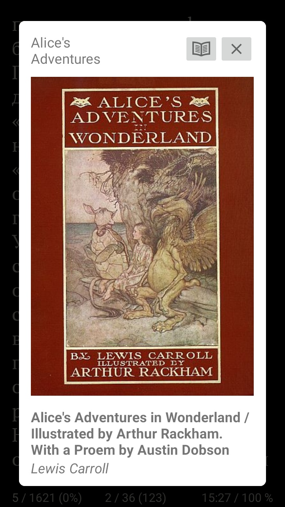

# KoReader
Android Ebook Reader

# Formats
- FB2: self writed FB2 parser
- Epub: Parser with nl.siegmann.epublib

# Features
- File-Picker with Android Content Provider and Preview Book-Cover, Title and Authors
- Preview Book-Info with Cover, Title, Authors and Description
- Read Book Section by Section
- Go-To Function: goto textpage or Section
- Bookmarks
- Notes preview
- Images - in text and large preview

# Settings
- Theme selection: Light / Dark
- Color setting: Foreground, Background, Link - theme separated
- Font selection
- Text: size, line- and letter- spacing
- Tap Zones

# Screenshots

## Open book dialog

## Book info dialog

## Title page with cover

## Dark theme

## Quick settings
